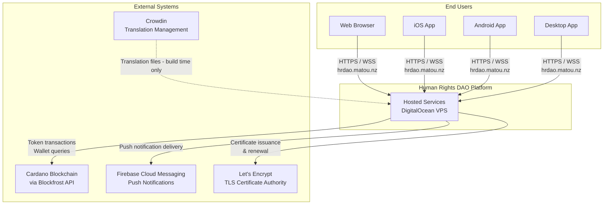
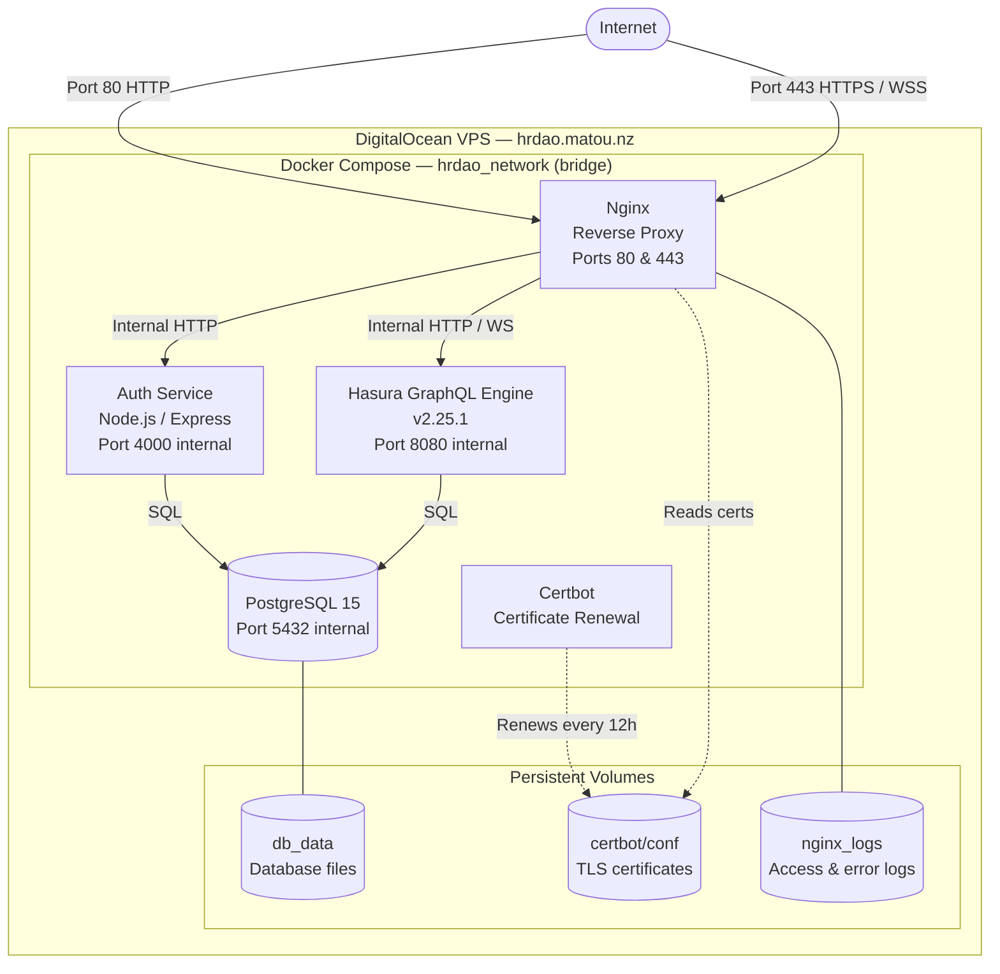
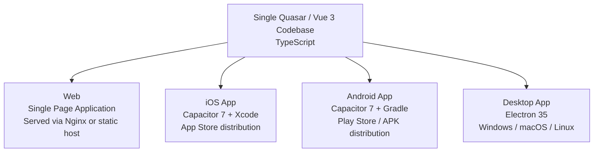
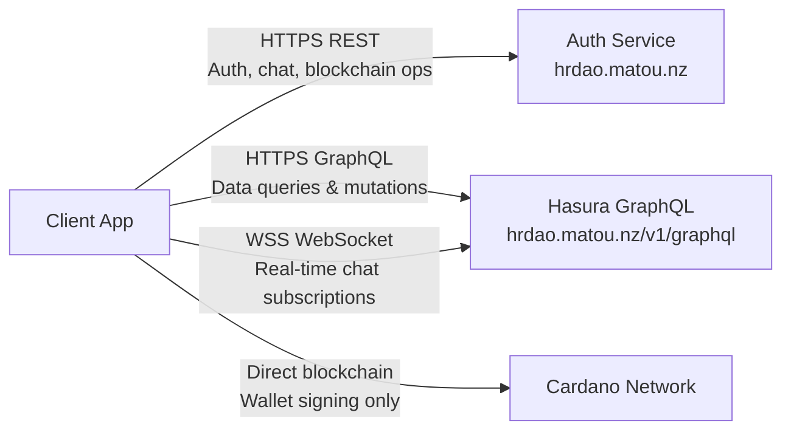
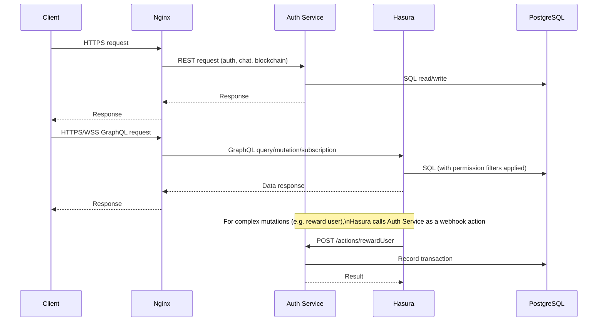
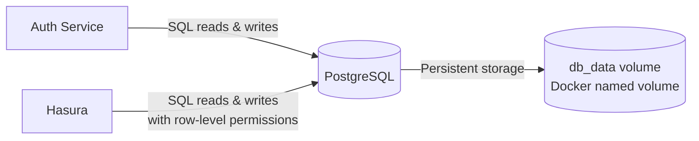
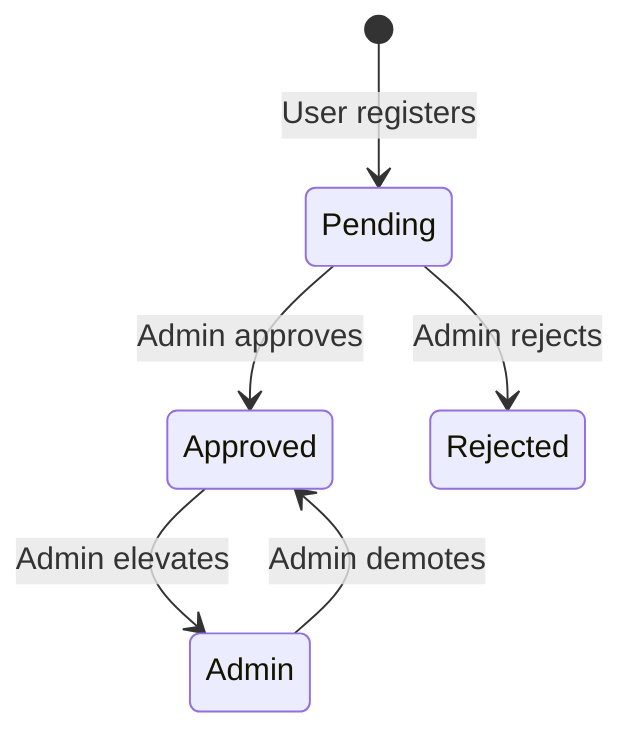
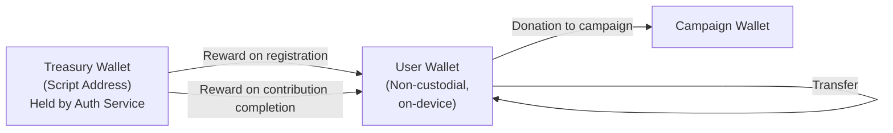
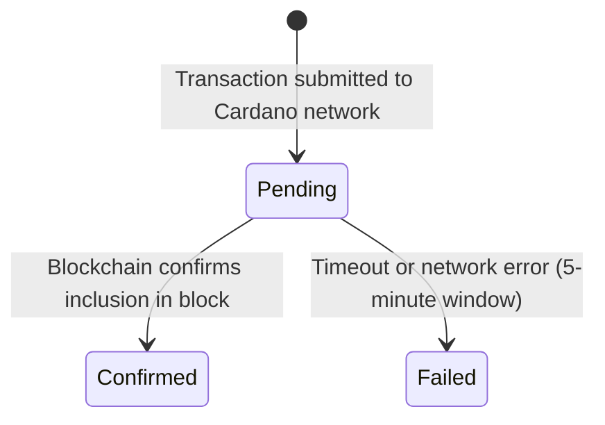
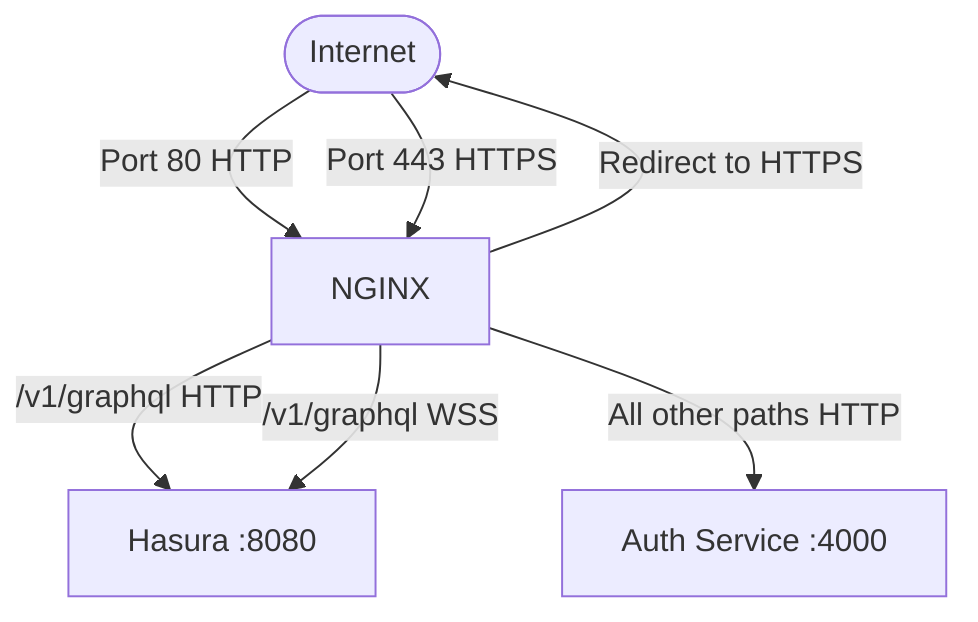

# System Architecture Overview
## Human Rights DAO (Amnesty DAO)

**Version:** 1.0.1  
**Organisation:** Matou Collective, built for Amnesty International  
**Audience:** External Technical Readers / Auditors  
**License:** AGPL-3.0

---

## Table of Contents

1. [Purpose & Scope](#1-purpose--scope)
2. [System Overview](#2-system-overview)
3. [System Context](#3-system-context)
4. [Deployment Environment](#4-deployment-environment)
5. [Frontend Stack](#5-frontend-stack)
6. [Backend Services](#6-backend-services)
7. [Data Storage](#7-data-storage)
8. [Authentication](#8-authentication)
9. [Blockchain Integration](#9-blockchain-integration)
10. [Network & Traffic Routing](#10-network--traffic-routing)
11. [External Service Dependencies](#11-external-service-dependencies)
12. [Security Posture](#12-security-posture)

---

## 1. Purpose & Scope

This document describes the system architecture of the Human Rights DAO platform — a multi-platform application that incentivises civic engagement through a blockchain-based token reward system built on the Cardano network.

It is intended to give an external technical reader — including auditors, technical stewards, and integration partners — a clear and accurate picture of:

- What systems exist and where they run
- How those systems communicate
- Where user data is stored and how it is protected
- How the platform authenticates users
- How the Cardano blockchain is integrated

This document describes the system as deployed. It does not describe internal code structure or implementation detail.

---

## 2. System Overview

Human Rights DAO allows users to:

- Register and authenticate using a non-custodial Cardano blockchain wallet (no passwords)
- Earn on-chain tokens by completing activism tasks (visiting content, sharing campaigns, scanning QR codes at events)
- Donate earned tokens to curated human rights campaigns
- Participate in community chat rooms with real-time messaging
- Receive push notifications on mobile devices

The platform is accessible as a **web application**, **iOS app**, **Android app**, and **desktop application** — all delivered from a single shared codebase.

An **admin interface** is included for managing users, contributions, campaigns, and chat rooms.

---

## 3. System Context

The diagram below shows the Human Rights DAO platform in its full external context — the user-facing clients, the hosted platform services, and the third-party systems it depends on.



---

## 4. Deployment Environment

### 4.1 Hosting

The platform is hosted on a single **DigitalOcean VPS** (IP: `134.199.168.68`), accessible at the domain `hrdao.matou.nz`.

All platform services run as Docker containers, orchestrated by **Docker Compose**. All containers share an isolated private bridge network (`hrdao_network`) and communicate with each other by service name, not by public IP.

### 4.2 Service Topology



### 4.3 Container Summary

| Container | Role | Public Exposure |
|---|---|---|
| `nginx` | Reverse proxy, TLS termination, request routing | Ports 80 and 443 |
| `auth-service` | Authentication, chat APIs, blockchain operations | Internal only (via Nginx) |
| `graphql-engine` | GraphQL API and real-time subscriptions | Internal only (via Nginx) |
| `postgres` | Primary relational database | Internal only |
| `certbot` | Automated TLS certificate renewal | None |

Only Nginx is exposed to the public internet. All other services are reachable only within the private Docker network.

### 4.4 Environments

| Environment | Configuration | Notes |
|---|---|---|
| **Production** | Docker Compose with `--profile production` | Nginx and Certbot active; all traffic over HTTPS |
| **Development** | Docker Compose (no profile) | Nginx and Certbot excluded; services accessed directly on local ports |

---

## 5. Frontend Stack

### 5.1 Overview

The frontend is a single codebase built with the **Quasar framework** (Vue 3, TypeScript) that compiles to four distinct deployment targets.



### 5.2 What the Frontend Does

- Connects to the **Auth Service** (HTTPS REST) for login, registration, and chat
- Connects to **Hasura** (HTTPS GraphQL and WSS WebSocket) for all data queries and real-time updates
- Manages a local, non-custodial **Cardano wallet** on-device (private keys never leave the device)
- Supports three languages: **English, Traditional Chinese, Thai**
- Uses **native device capabilities** on mobile: camera, barcode scanner, biometric authentication, push notifications, share sheet

### 5.3 Communication Channels



All client-to-server traffic in production is encrypted (HTTPS / WSS). In development, HTTP and WS are used on localhost.

---

## 6. Backend Services

### 6.1 Auth Service

The Auth Service is a **Node.js application** (Express framework) responsible for all operations that require privileged or sensitive access:

| Responsibility | Detail |
|---|---|
| User registration | Accepts wallet address and profile data; writes user record to database |
| Authentication | Issues login challenges; verifies Cardano wallet signatures; issues JWTs |
| Chat management | Serves REST endpoints for listing chats, fetching messages, sending messages, and tracking read state |
| User management | Provides admin endpoints for approving, rejecting, and managing users |
| Blockchain operations | Executes on-chain token transfers using the treasury wallet (reward distribution, donation submission) |
| Transaction confirmation | Polls the Cardano network to confirm pending transactions and updates database records |
| Push notifications | Dispatches mobile push notifications via Firebase Cloud Messaging |
| Client-side log ingestion | Accepts and stores diagnostic logs from client applications |

The Auth Service has no public-facing UI. It exposes a REST API consumed by the frontend and a set of webhook endpoints consumed internally by Hasura.

### 6.2 Hasura GraphQL Engine

Hasura is an open-source GraphQL engine that sits in front of PostgreSQL and provides:

| Capability | Detail |
|---|---|
| GraphQL API | Auto-generated queries and mutations for all database tables |
| Real-time subscriptions | WebSocket-based live data push (used for chat message delivery) |
| Row-level permissions | Access control enforced per user via JWT claims — users only see their own data |
| Action webhooks | Delegates complex mutations (token rewards, donations) to the Auth Service |

Hasura does not contain business logic. It is a data access and permission layer only.

### 6.3 Service Interaction



---

## 7. Data Storage

### 7.1 Primary Database

All application data is stored in a single **PostgreSQL 15** instance running as a Docker container with a persistent named volume (`db_data`). Data persists across container restarts and redeployments.

### 7.2 Data Domains

| Domain | Tables | Description |
|---|---|---|
| **Users** | `users`, `memberships` | User accounts, wallet addresses, profiles, approval status, roles |
| **Chat** | `chats`, `chat_participants`, `messages`, `chat_read_timestamps` | Chat rooms, participants, messages, and read-state tracking |
| **Contributions** | `contributions`, `user_contributions` | Activism tasks and user completion records |
| **Campaigns** | `campaigns`, `campaign_donations` | Fundraising campaigns and individual donation records |
| **Token Transactions** | `token_transactions` | All token movements, with Cardano transaction hashes for on-chain traceability |
| **Notifications** | `user_notification_tokens` | FCM device tokens for push notification delivery |
| **Diagnostics** | `app_logs` | Client-side log events ingested from mobile/web apps |

### 7.3 Data Flow



### 7.4 Schema Management

Database schema is version-controlled using **Hasura CLI migrations** stored in the repository at `backend/hasura/migrations/`. Migrations are applied sequentially and are the authoritative definition of the database schema.

### 7.5 Data Residency

All data is stored within the Docker volume on the DigitalOcean VPS. No user data is replicated to external storage services. Profile images are stored as base64-encoded text directly in the `users` table.

---

## 8. Authentication

### 8.1 Approach

The platform uses **cryptographic wallet-based authentication** (Cardano CIP-8 standard). There are no passwords. A user's identity is their Cardano wallet address, and authentication is proof of control over the corresponding private key via digital signature.

### 8.2 Authentication Flow

```mermaid
sequenceDiagram
    participant U as User Device
    participant A as Auth Service
    participant DB as PostgreSQL
    participant H as Hasura

    U->>A: Request login challenge
    A->>DB: Verify user is approved; store one-time nonce
    A-->>U: Return nonce string, expires in 10 minutes

    Note over U: User signs nonce with\nCardano wallet private key\n(never leaves device)

    U->>A: Submit userId + signed nonce
    A->>DB: Retrieve stored nonce and wallet address
    A->>A: Verify signature against wallet address (CIP-8)
    A->>DB: Invalidate nonce (rotate)
    A-->>U: Issue JWT (valid 12 hours)

    U->>H: GraphQL request with JWT in Authorization header
    H->>H: Verify JWT signature; extract user ID and role
    H->>DB: Execute query with permission filters applied
    H-->>U: Filtered data response
```

### 8.3 JWT and Permissions

Once issued, the JWT is used for all subsequent requests — both to the Auth Service (REST) and to Hasura (GraphQL). The JWT contains the user's ID and approval status, which Hasura uses to enforce row-level access control. For example, a user can only read their own token transactions, contribution completions, and private chat messages.

### 8.4 User Status

Users progress through an approval lifecycle managed by administrators:



Users with `Pending` or `Rejected` status cannot obtain a valid login challenge and are effectively locked out of the application.

---

## 9. Blockchain Integration

### 9.1 Network

The platform integrates with the **Cardano blockchain** via the **Blockfrost API** — a hosted Cardano node access service. The target network (testnet or mainnet) is configurable per deployment.

### 9.2 Token Economy

The platform manages a custom Cardano native token (UTIL token) with the following flows:



The treasury wallet is held exclusively by the Auth Service backend. Users' private keys are held exclusively on their own devices and are never transmitted to the platform.

### 9.3 Transaction Lifecycle

All on-chain token transactions follow this lifecycle:



The Auth Service polls Blockfrost to detect confirmation and updates the `token_transactions` record accordingly. This record links each platform-level transaction to its Cardano transaction hash, providing full on-chain traceability.

### 9.4 Client-Side Wallet

On mobile and desktop, the user's Cardano wallet is generated locally using a BIP39 mnemonic phrase. The private key is stored in **hardware-backed secure storage** on the device. Campaign donations are constructed server-side (unsigned), returned to the client, signed locally on-device, and then submitted back to the server for broadcast — the private key never transits the network.

---

## 10. Network & Traffic Routing

### 10.1 Inbound Traffic

All inbound traffic enters the VPS on ports 80 (HTTP) and 443 (HTTPS/WSS) and is handled exclusively by Nginx.



HTTP traffic on port 80 is redirected to HTTPS. There is no direct public access to the Auth Service, Hasura, or PostgreSQL ports.

### 10.2 TLS / SSL

TLS certificates are issued by **Let's Encrypt** and managed by a dedicated Certbot container. Certbot attempts renewal every 12 hours. Nginx is reloaded every 6 hours to apply any renewed certificates without downtime. Certificate files are stored in a shared Docker volume accessible to both Nginx and Certbot.

### 10.3 CORS

The Auth Service enforces a strict CORS allowlist. Only requests originating from known client origins (the production web domain, Capacitor mobile apps, and localhost development addresses) are accepted. Requests from unlisted origins are rejected at the HTTP level.

---

## 11. External Service Dependencies

| Service | Provider | Purpose | Data Shared |
|---|---|---|---|
| **Blockfrost API** | Blockfrost.io | Cardano node access — submit transactions, query wallet balances, confirm transaction inclusion | Wallet addresses, transaction data |
| **Firebase Cloud Messaging** | Google Firebase | Delivery of push notifications to iOS and Android devices | Device FCM tokens, notification payloads |
| **Let's Encrypt** | Internet Security Research Group | Issuance and renewal of TLS certificates for `hrdao.matou.nz` | Domain name only |
| **Crowdin** | Crowdin.com | Translation management for localisation strings (build-time only, not runtime) | Translation source strings |

No user personal data (names, emails, profile images) is transmitted to any external service other than Firebase (notification payloads, which contain only notification text and the target device token).

---

## 12. Security Posture

### 12.1 Network Security

- **Single public entry point.** Only Nginx is exposed to the public internet. All backend services are isolated within a private Docker bridge network.
- **TLS everywhere in production.** All traffic is encrypted in transit via HTTPS and WSS with Let's Encrypt certificates.
- **No direct database exposure.** PostgreSQL is not accessible outside the Docker network.

### 12.2 Authentication Security

- **No passwords.** Authentication relies entirely on cryptographic proof of wallet ownership. A compromised database does not yield user credentials.
- **Nonce expiry and rotation.** Login challenges are single-use and expire after 10 minutes. They are invalidated immediately upon successful verification.
- **Short-lived sessions.** JWTs expire after 12 hours, limiting the impact of a compromised token.

### 12.3 Authorisation

- **Row-level data access control** is enforced by Hasura using JWT claims. Users are structurally prevented from accessing other users' private data at the database query level.
- **Admin-only operations** are enforced on the Auth Service by inspecting the user's status claim before processing privileged requests.

### 12.4 Wallet and Key Security

- **Non-custodial wallets.** The platform never holds or transmits users' private keys. The treasury wallet (held by the backend) is the only private key the platform manages, and it is stored only as a server-side environment variable.
- **Client-side signing.** Donation transactions are signed on-device; the private key is never sent over the network.

### 12.5 Secrets Management

All secrets (JWT secret, Hasura admin secret, Blockfrost API key, Firebase credentials, database credentials) are provided via environment variables at container startup. They are not stored in source control or in container images.

---

*Document produced from analysis of the Human Rights DAO system repository and deployment configuration. Matou Collective.*
